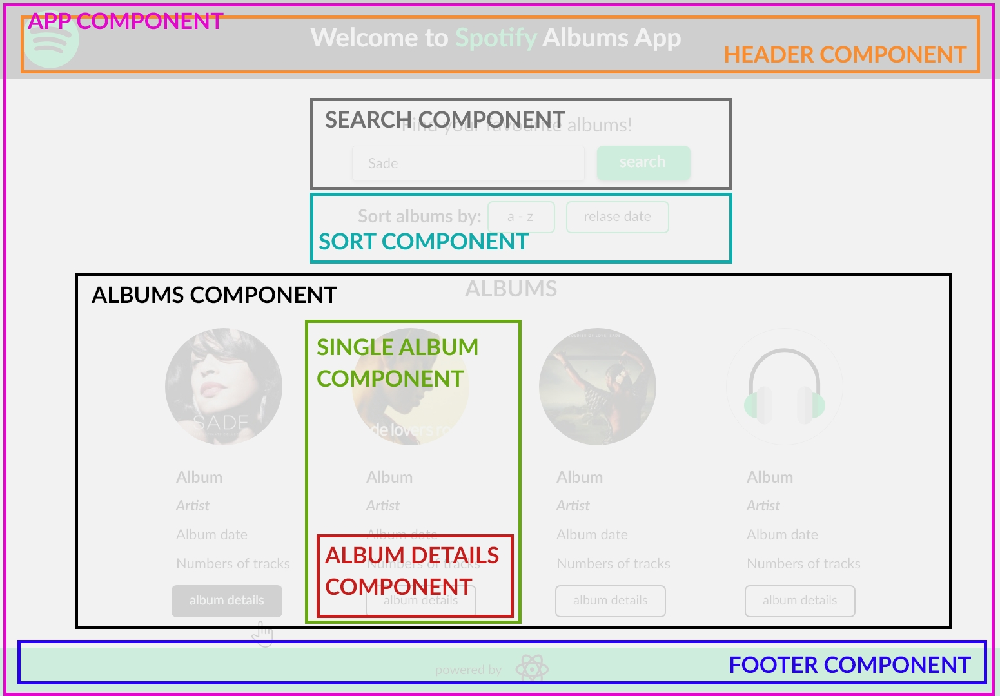
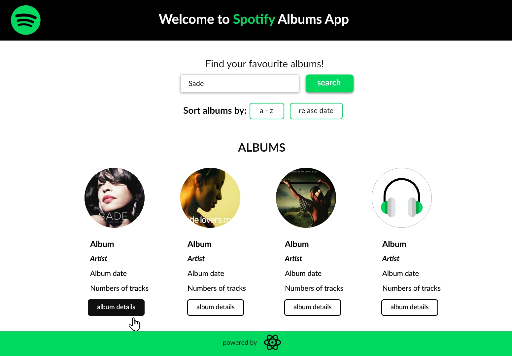
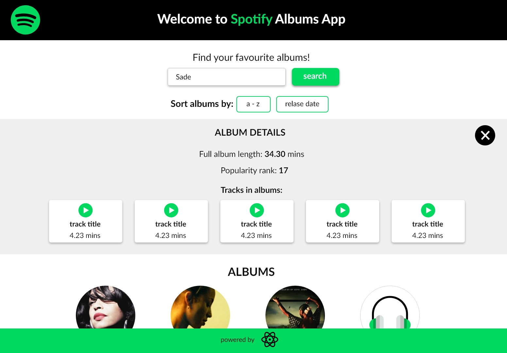
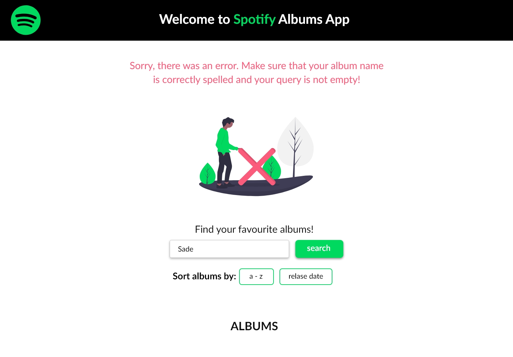

### Spotify Albums App

Spotify App that let You browse favourite albums and get some details about them.

App is presented in responsive manner, however it's much more comfortable to play around it on desktop.

Project utilize react.js library and it's divided into component's stucture.



Designed and prototyped in Adobe XD.







#### Functionalities: 
1. Searching any albums in Spotify, by their names. Each albums have:
  * cover image (or placeholder if image is not provided)
  * album name
  * artist name
  * numbers of tracks in the album

2. Filtering fetched albums in alphabetical/release date order.

3. Get each album details, which contains:
  * full album length
  * popularity rank
  * list with all tracks in the album along with their duration and link to actual song on Spotify online player

#### For developers [Setup instructions];

1. Register or login to your Spotify account and register an app [here](https://developer.spotify.com/dashboard/applications) to get CLIENT_ID and CLIENT_SECRET.


Click "edit settings" and set "Redirect URLs" to http://localhost:8888/callback. Hit "add" button on the right of the input field and also "save" on page bottom.


2. Open two separate shells. Cd in first to frontend-app and in second to backend-app.

3. Install project dependencies with `npm install` (both in frontend-app and backend-app).

4. From backend-app shell export your credentials as environment variables:

  * for BASH: 
    ```
    $ export SPOTIFY_CLIENT_ID=YourClientIdNumber
    $ export SPOTIFY_CLIENT_SECRET=YourClientSecretNumber
    ```
    you can check if they were exported correctly by running: 
    ```
    $ echo $SPOTIFY_CLIENT_ID $SPOTIFY_CLIENT_SECRET
    ```

  * for Windows CMD:
    ```
    $ SET SPOTIFY_CLIENT_ID=YourClientIdNumber
    $ SET SPOTIFY_CLIENT_SECRET=YourClientSecretNumber
    ```

    Verify with: 
    ```
    $ SET
    ```

5. In backend-app shell run `npm start`.

6. In frontend-app shell run `npm start` as well. NOTE: create-react-app runs by default on port 3000, but if You set it differently, You need to change it in backend-app/server.js.

7. Go to http://localhost:8888/login and login to Spotify to start. You should be redirected to localhost:3000 with inserted access token as url parameter.

8. Acces token is valid for about an hour. If app stopps working navigate to http://localhost:8888/login to refresh your access token. 

#### Dependencies

* App utilize [Spotify API](https://developer.spotify.com/documentation/web-api/reference/)
* project was bootstrapped with [Create React App](https://github.com/facebook/create-react-app).
* OAuth helper service [OAuth bridge template](https://github.com/mpj/oauth-bridge-template)
* designed in [Adobe XD](https://www.adobe.com/pl/products/xd.html)
* layout made with [Flexbox Layout](https://css-tricks.com/snippets/css/a-guide-to-flexbox/)
* BEM Methodology - [documentation](https://en.bem.info/)
* icons by [Flaticon](https://www.flaticon.com/home)
